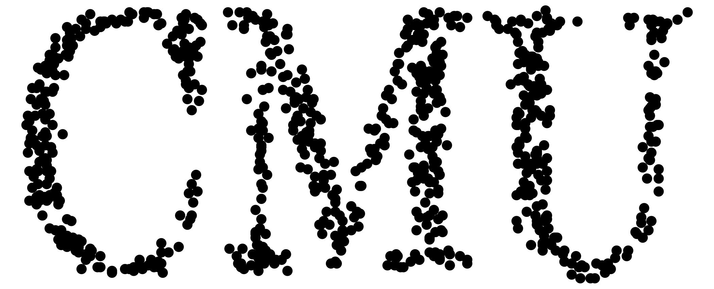

# cmu-tshirt-generator

Go from: 

To: 

--- About ---

Code written by Nicolas Kim, graduate student in the Department of Statistics at
Carnegie Mellon University (Pittsburgh, PA, blah blah). 

You can specify a filename for a PNG file you want to "data-ify." 

You might have to mess with the parameters a bit. As defaults, I've included
some sensible ones and the "CMU" wordmark. 

Works with PNG image files. 

--- Parameters ---

1. filename - a string, i.e. "CMU.png".

2. seednum - your favorite random seed. I recommend setting
   par(mfrow=c(something, else)) and testing a whole bunch of different seed
   values simultaneously. 

3. propscreen - proportion of pixels in the original image that are
   stochastically removed from the pixel matrix. 

4. varamt - the pixels remaining after the propscreen are then pushed in a
   random direction according to a rounded Gaussian distribution with your
   favorite standard deviation. 

5. writename - if `NULL`, calling the function won't write the output to disk.
   Or, you can give it a filename for the output image. 
